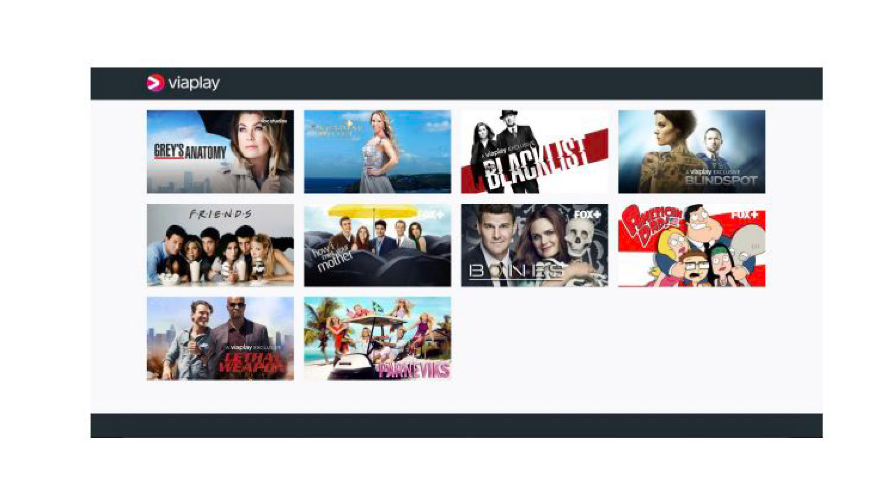

## Final assessment

The goal of this is to assess your skills in programming and associated tasks (version control, DevOps, agile, etc). You will be given 2 programming challenges and ssome programming related questions. 

1. Comments Challenge
2. Viaplay Challenge
3. Written submission

#### Time & Format
4 hours during withch you need to be online in a coach supervisioned conference call (Google Meet). You need to share your the screen/monitor where your IDE is displayed. 

#### Delivery:

All code must be delivered in the form of a **Pull Request** against the repositories that the examiner will provide to you (onefor each challenge).

## Comments Challenge


## Viaplay Challenge

You are challenged with the task of replicating a UI. It is a desktop only web application listing TV series from Viaplay. 

The pesented UI looks like this:




You need to fetch the data from the Viaplay API andd find the appropoite attributes that hold the information you need. 

The API is located at:

```
https://content.viaplay.se/pc-se/serier/samtliga
```

The TV series listings can be found at: 
```js
yourDataObject._embedded['viaplay:blocks'][0]._embedded['viaplay:products']
```

You can find a logo with transparent background at: 
```
https://kundservice.viaplay.se/wp-content/themes/viaplaycs/assets/dist/images/viaplay_white.svg
```

Displaying the shows in a row with right formatting is a bit challenging. To help you, we've chosen to provide an example solution that is proven to yield good results. It is up to you if you want to use it though. The rest of the css needed to replicate the UI is up to you to define.

```css
.display-show {
    display: inline-block;
    width: 23%;
    width: calc(25% - ( ( 20px ) * 0.75 ) );
    margin-right: 20px;
    margin-bottom: 20px;
}

.display-show:nth-child(4n+4) {
    margin-right: 0;
}

.display-show img {
    width: 100%;
    height: auto;
}
```

Good luck and Happu Coding. 

## Written submission
Please explain the steps you think are necessary to perform in order to get a feature done, from an idea to an implemened ssolution that is running in production. Be as detailed as possible. 
